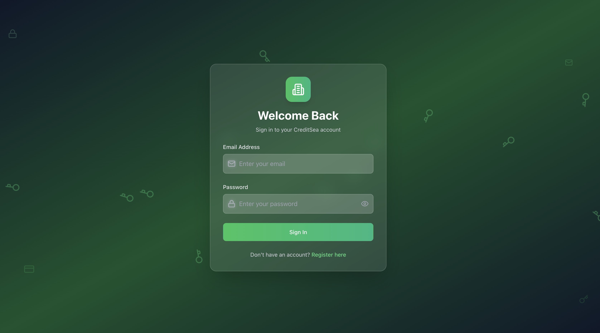
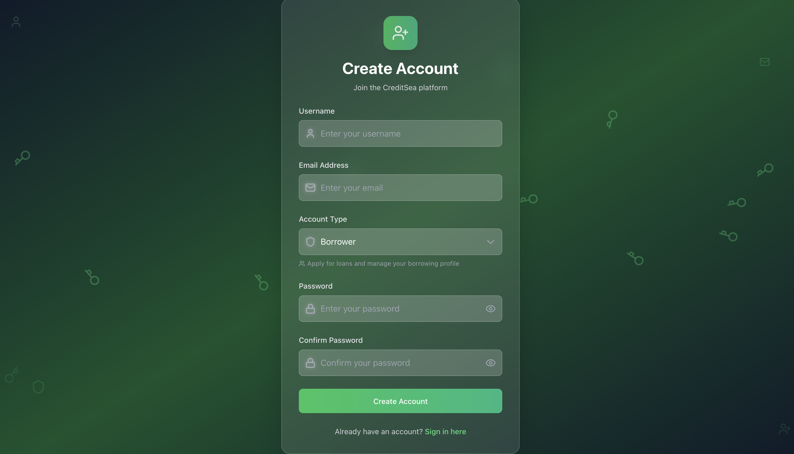
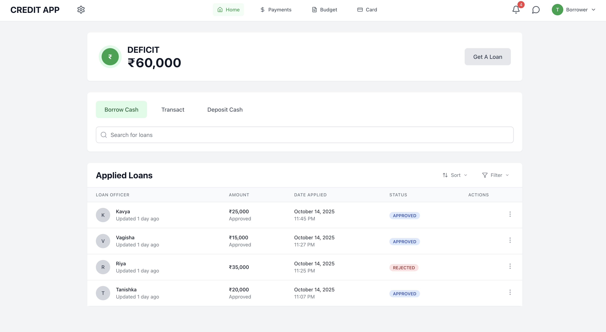
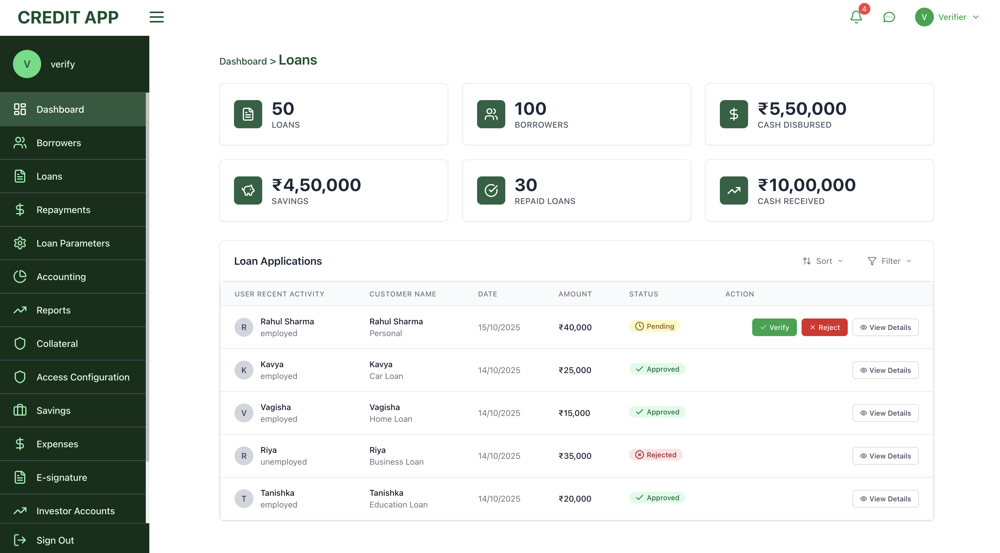
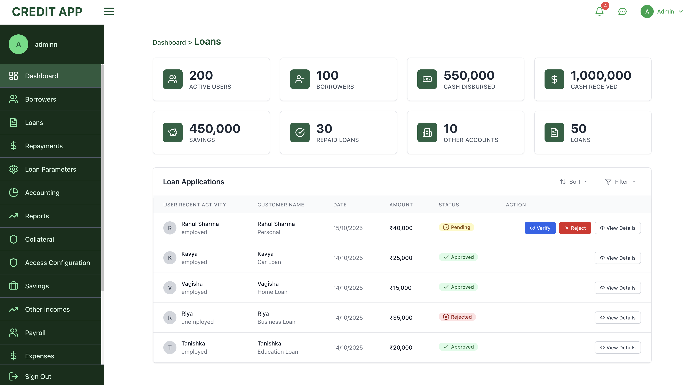

<div align="center">


# 🏦 CreditSea - Loan Management System


### 💼 A comprehensive, enterprise-grade loan management application built with modern web technologies

[](https://react.dev/)
[](https://www.typescriptlang.org/)
[](https://nodejs.org/)
[](https://www.mongodb.com/)
[](https://tailwindcss.com/)
[](https://expressjs.com/)


### 📑 Quick Navigation

[✨ Features](#-features) • [🛠️ Tech Stack](#️-tech-stack) • [📸 Screenshots](#-screenshots) • [📦 Installation](#-installation) • [🚀 Deployment](#-deployment)


</div>

---

## 🌟 Features

<div align="center">


### 🚀 What Makes CreditSea Special

</div>

### 🔐 **Authentication & Authorization**
```
🛡️ Bank-Level Security Features:
├── ✅ Secure JWT-based authentication
├── ✅ Role-based access control (Admin, Verifier, Borrower)
├── ✅ Password encryption with bcryptjs
├── ✅ Protected routes and middleware
└── ✅ Session management and auto-logout
```

### 💼 **Loan Management**
```
💰 Complete Loan Lifecycle:
├── 📝 Loan application submission with comprehensive details
├── 🔄 Real-time status tracking (Pending → Under Review → Approved → Disbursed → Completed)
├── 📎 Document upload support
├── 📜 Application history tracking
└── ⚡ Instant notifications on status changes
```

### 👥 **Role-Based Dashboards**

<table>
<tr>
<td width="33%" align="center">

#### 💰 **Borrower Dashboard**


✨ **Key Features:**
- 📝 Apply for new loans
- 📊 Track application status
- 📚 View loan history
- 🔍 Search & filter apps
- 🔔 Real-time notifications

</td>
<td width="33%" align="center">

#### ✅ **Verifier Dashboard**


✨ **Key Features:**
- 📋 Review pending applications
- ✓ Verify borrower info
- ⚡ Update application status
- 🎯 Filter and sort
- 📊 Advanced analytics

</td>
<td width="33%" align="center">

#### 👨‍💼 **Admin Dashboard**


✨ **Key Features:**
- 🎛️ Full system oversight
- 👥 User management
- ✅ Approve/reject loans
- 📈 System statistics
- 🔍 Complete audit trail

</td>
</tr>
</table>

### 📊 **Analytics & Reporting**
```
📈 Business Intelligence:
├── 📊 Real-time dashboard statistics
├── 🎯 Application status distribution
├── 💰 Loan amount analytics
├── 👤 User activity tracking
└── 📉 Visual data representation
```

### 🎨 **Modern UI/UX**
```
✨ Design Excellence:
├── 🎨 Beautiful, responsive design
├── 🌈 Custom green color scheme (#0A512FE8)
├── ✨ Smooth animations and transitions
├── 📱 Mobile-first approach
├── 🎯 Intuitive navigation
└── 💼 Professional dashboard interface
```

<div align="center">


</div>

---

## 📸 Screenshots

<div align="center">


### 🎨 Visual Tour of CreditSea

</div>

### 🔑 Login Page
<div align="center">
  
  
  
  
  
  <p><em>✨ Secure authentication with beautiful animated background and glassmorphism effects</em></p>
  
  
  
  
  
</div>

---

### 📝 Registration Page
<div align="center">
  
  
  
  
  
  <p><em>🎯 Multi-role registration (Admin/Verifier/Borrower) with role-specific features</em></p>
  
  
  
  
  
</div>

---

### 👤 User/Borrower Dashboard
<div align="center">
  
  
  
  
  
  <p><em>💰 Borrower interface for loan applications, tracking, and management</em></p>
  
  
  
  
  
  
</div>

---

### ✅ Verifier Dashboard
<div align="center">
  
  
  
  
  
  <p><em>🔍 Verifier interface for reviewing, verifying, and approving loan applications</em></p>
  
  
  
  
  
  
</div>

---

### 👨‍💼 Admin Dashboard
<div align="center">
  
  
  
  
  
  <p><em>🎛️ Admin interface with complete system control, user management, and analytics</em></p>
  
  
  
  
  
  
</div>

<div align="center">


</div>

---

## 🛠️ Tech Stack

<div align="center">

### 💻 Powered by Modern Technologies


</div>

### **⚛️ Frontend Technologies**
| Technology | Version | Purpose | Icon |
|------------|---------|---------|------|
| **⚛️ React** | 19.1.0 | UI Library with latest features |  |
| **📘 TypeScript** | 5.8.3 | Type-safe development |  |
| **⚡ Vite** | 4.5.14 | Lightning-fast build tool |  |
| **🎨 TailwindCSS** | 3.4.18 | Utility-first CSS framework |  |
| **🛣️ React Router** | 7.7.1 | Client-side routing |  |
| **🎯 Lucide React** | 0.525.0 | Beautiful icon library |  |
| **🎭 Headless UI** | 2.2.6 | Accessible UI components |  |

### **🔧 Backend Technologies**
| Technology | Version | Purpose | Icon |
|------------|---------|---------|------|
| **🟢 Node.js** | 18+ | JavaScript runtime environment |  |
| **🚂 Express.js** | 4.18.2 | Fast web application framework |  |
| **📘 TypeScript** | 5.8.3 | Type-safe backend development |  |
| **🍃 MongoDB** | 8.16.4 | NoSQL database |  |
| **🦸 Mongoose** | 8.16.4 | MongoDB object modeling |  |
| **🔐 JWT** | 9.0.2 | Secure authentication tokens |  |
| **🔒 bcryptjs** | 3.0.2 | Password hashing & encryption |  |
| **🌐 CORS** | 2.8.5 | Cross-origin resource sharing |  |

### **🔨 Development & Deployment Tools**
| Tool | Purpose | Icon |
|------|---------|------|
| **✅ ESLint** | Code linting and quality assurance |  |
| **🎨 PostCSS** | CSS transformation and processing |  |
| **🔄 Nodemon** | Auto-restart development server |  |
| **⚙️ ts-node** | TypeScript execution engine |  |
| **▲ Vercel** | Cloud deployment platform |  |


---

## 📦 Installation

<div align="center">


### 🚀 Get Started in Minutes!

</div>

### **📋 Prerequisites**

<table>
<tr>
<td align="center" width="33%">
<br>
<b>Node.js v18+</b>
</td>
<td align="center" width="33%">
<br>
<b>MongoDB</b>
</td>
<td align="center" width="33%">
<br>
<b>npm or yarn</b>
</td>
</tr>
</table>

### **⚡ Quick Start Guide**

#### 1️⃣ **Clone the Repository**
   ```bash
git clone https://github.com/yourusername/creditsea.git
   cd CreditSea
   ```

#### 2️⃣ **Install Backend Dependencies**
   ```bash
   cd backend
   npm install
```
> 📦 Installing Express, MongoDB, JWT, and more...
   
#### 3️⃣ **Install Frontend Dependencies**
```bash
   cd ../frontend
   npm install
   ```
> ⚛️ Installing React, Vite, TailwindCSS, and more...

#### 4️⃣ **Environment Configuration**

Create a `.env` file in the backend directory:

```env
MONGODB_URI=mongodb://localhost:27017/creditsea
   PORT=5000
   NODE_ENV=development
JWT_SECRET=your-super-secret-jwt-key-change-this-in-production
   ```
> 🔐 **Important:** Change the JWT_SECRET in production!

#### 5️⃣ **Start the Backend Server**
   ```bash
cd backend
   npm run dev
```
> 🟢 Server running at http://localhost:5000
   
#### 6️⃣ **Start the Frontend Development Server**
```bash
cd frontend
   npm run dev
   ```
> ⚡ Frontend running at http://localhost:5173

#### 7️⃣ **Seed Initial Data (Optional)**
   ```bash
cd backend
   npm run seed
   ```
> 🌱 Creating default users (Admin, Verifier, Borrower)

<div align="center">

### 🎉 **You're All Set!**

Visit **[http://localhost:5173](http://localhost:5173)** to see your app in action!


</div>


---

## 📱 Core Features Overview

### 🏠 **Dashboard**
- Real-time statistics and metrics
- Loan application overview
- User management (Admin only)
- Analytics and reporting
- Quick actions and shortcuts

### 💰 **Loan Application Process**
1. **Submit Application** - Fill comprehensive loan form
2. **Pending Review** - Application awaits initial review
3. **Under Review** - Verifier checks application
4. **Approved/Rejected** - Decision made
5. **Disbursed** - Funds released (if approved)
6. **Completed** - Loan fully repaid

### 🔍 **Advanced Features**
- 🔎 **Search & Filter** - Find applications quickly
- 📊 **Sort Options** - By date, amount, or status
- 🔔 **Notifications** - Real-time updates
- 📈 **Analytics** - Visual data insights
- 👥 **User Management** - Admin controls
- 🎯 **Role Permissions** - Granular access control

---

## 🔧 Development Scripts

### **Backend Scripts**
```bash
npm run dev          # Start development server
npm run build        # Build TypeScript to JavaScript
npm run start        # Start production server
npm run seed         # Seed initial database data
npm run vercel-build # Build for Vercel deployment
```

### **Frontend Scripts**
```bash
npm run dev      # Start Vite development server
npm run build    # Build for production
npm run preview  # Preview production build
npm run lint     # Run ESLint
```

---

---

## 🗂️ Project Structure

```
CreditSea/
├── backend/
│   ├── src/
│   │   ├── controllers/     # Request handlers
│   │   ├── models/          # Database models
│   │   ├── routes/          # API routes
│   │   ├── middleware/      # Auth & validation
│   │   ├── index.ts         # Server entry point
│   │   └── seed.ts          # Database seeder
│   ├── dist/                # Compiled JavaScript
│   ├── package.json
│   └── tsconfig.json
│
├── frontend/
│   ├── src/
│   │   ├── components/      # React components
│   │   │   ├── auth/        # Login, Register
│   │   │   └── dashboard/   # Dashboard components
│   │   ├── pages/           # Main pages
│   │   ├── context/         # React Context
│   │   ├── utils/           # Helper functions
│   │   ├── App.tsx          # Main app component
│   │   └── main.tsx         # Entry point
│   ├── public/              # Static assets
│   ├── package.json
│   └── vite.config.js
│
└── README.md
```

---

## 🚀 Deployment

<div align="center">


### ☁️ Deploy to the Cloud


</div>

### **▲ Vercel Deployment**

#### 1️⃣ **Install Vercel CLI**
```bash
npm install -g vercel
```

#### 2️⃣ **Deploy Backend**
```bash
cd backend
vercel --prod
```
> 🚀 Backend deploying...

#### 3️⃣ **Deploy Frontend**
```bash
cd frontend
vercel --prod
```
> ⚡ Frontend deploying...

### **🔐 Environment Variables for Production**

<table>
<tr>
<th>Variable</th>
<th>Description</th>
<th>Required</th>
</tr>
<tr>
<td><code>MONGODB_URI</code></td>
<td>MongoDB connection string</td>
<td>✅ Yes</td>
</tr>
<tr>
<td><code>JWT_SECRET</code></td>
<td>Strong secret key for JWT</td>
<td>✅ Yes</td>
</tr>
<tr>
<td><code>NODE_ENV</code></td>
<td>Set to <code>production</code></td>
<td>✅ Yes</td>
</tr>
</table>

> ⚠️ **Important:** Never commit `.env` files to version control!

---

## 🔒 Security Features

<div align="center">

### 🛡️ Bank-Level Security


</div>

<table>
<tr>
<td width="50%">

#### 🔐 **Authentication & Authorization**
- ✅ JWT-based authentication
- ✅ Password hashing with bcrypt
- ✅ Role-based access control
- ✅ Session management

</td>
<td width="50%">

#### 🛡️ **Data Protection**
- ✅ Protected API routes
- ✅ Input validation and sanitization
- ✅ CORS configuration
- ✅ Secure HTTP headers
- ✅ Environment variable protection

</td>
</tr>
</table>

<div align="center">


</div>

---

## 🎯 Future Enhancements

<div align="center">

### 🚀 Roadmap to Excellence


</div>

<table>
<tr>
<td width="50%" valign="top">

### 📧 **Communication**
- [ ] 📬 Email notifications
- [ ] 💬 In-app messaging
- [ ] 🔔 Push notifications
- [ ] 📱 SMS alerts

### 💳 **Financial Integration**
- [ ] 💰 Payment gateway integration
- [ ] 📊 Credit score integration
- [ ] 🏦 Bank account verification
- [ ] 💸 Auto-debit setup

</td>
<td width="50%" valign="top">

### 🌐 **Platform Expansion**
- [ ] 📱 Mobile applications (React Native)
- [ ] 🌍 Multi-language support
- [ ] 🌙 Dark mode
- [ ] 📥 Document upload functionality

### 📊 **Analytics & Reports**
- [ ] 📈 Advanced analytics dashboard
- [ ] 📄 Export reports (PDF/Excel)
- [ ] 🔮 AI-powered insights
- [ ] 🔐 Two-factor authentication

</td>
</tr>
</table>

<div align="center">


</div>

---

<div align="center">


## 📞 Reach Out to Me


### 👨‍💻 **Built with ❤️ by [Tanishka Verma](https://tanishka-info.netlify.app/)**

<a href="https://tanishka-info.netlify.app/">
  
</a>
<a href="mailto:tanishkaverma43@gmail.com">
  
</a>

### 💬 **For Support & Inquiries**
📧 Email: **tanishkaverma43@gmail.com**

---


### ⭐ **Star this repo if you find it helpful!** ⭐


**CreditSea** - Streamlining loan management for the modern world.

### 🛠️ Built With


---

### 📊 Project Stats


---

### 🌟 **Show Your Support**

Give a ⭐ if this project helped you!

<a href="https://www.buymeacoffee.com/tanishka" target="_blank">
  
</a>

</div>
